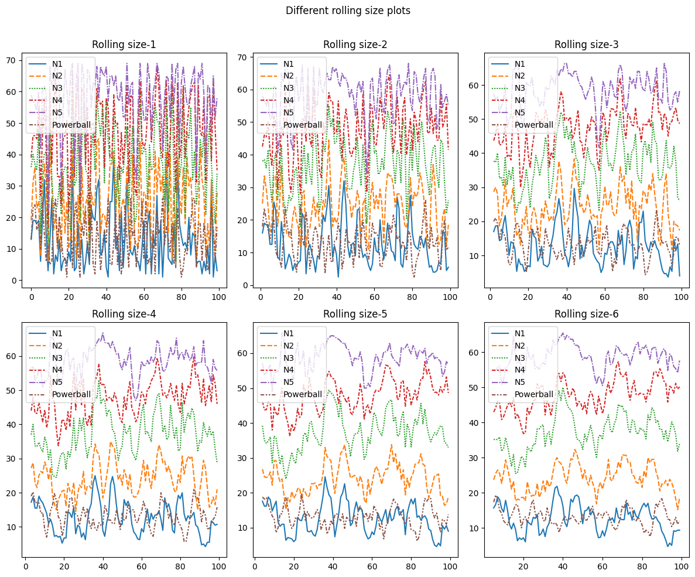

# Lottery: Powerball generation - have fun with machine learning technique
* This project was inspired by random selection lottery with machine learning technique.

## Assumptions:

* The probability to draw the ball, with CLT, it is assummed normal distributed.
* The probability of next drawing have the similar pattern as previous one year's drawing.

## Model: Labler -- Generator -- Selector -- Filter
1. Train the model with clustering agglomerative method from sklearn library.
    

    
2. Label data with two clusters according the silhouette score, and clustering visuliation results. Later these two labels will be used for logistic regression test.
3. Generate data with normal distributed model
`x = np.arange(start,end)`
`xU, xL = x + 0.5, x - 0.5`
`prob = ss.norm.cdf(xU, scale = std) - ss.norm.cdf(xL, scale = std)`
`prob = prob / prob.sum() # normalize the probabilities so their sum is 1`
`nums = np.random.choice(x, size = size, p = prob) `
4. Randomly select data from the generated data, predict the data with logistic regression classifier.If the selected data fall into training data category, the data is selected.
    * Generated numbers form new data set with original dataset.
    * The new dataset is then be trained with logistic regression. 
    * The metrics to select is recall. The generator continues generating numbers, while the selector continuing training and predict the results. 
    * When the recall is lower than 0.3 (theoretically 0.5), here, I define it failed to differentiate generated numbers from original numbers.
5. In the final selection, another filter is added. By analyzing previous data, frequncy and range of the numbers were generated. The filter range is then used to generate numbers. `[12, 24, 37,47,	70]`
    * Specifically, the range is created by time-series data analysis. With rolling of 4 data, clear pattern could be extracted from the data.
    

    
    

## App
* The project is built with Docker container.
* Also it is deployed with FastAPI.
* To build the project with docker, use the following command. 
`cd Lottery`
`docker run -dp 8000:8000 image_name` name the docker image, switch to localhost:8000/docs you should be able to launch the swagger app.

* To run the app locally
`cd src`
`python main.py`

